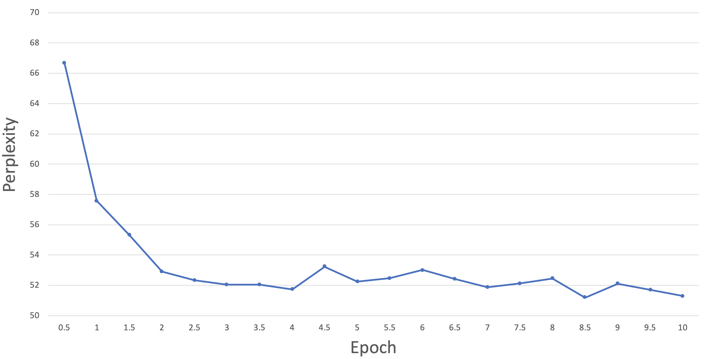

# Belgian GPT-2 🇧🇪

**A GPT-2 model pre-trained on a very large and heterogeneous French corpus (~60Gb)**.

## Table of contents
1. [Using BelGPT-2 for Text Generation in French](#using_belgpt2)
2. [Pre-training BelGPT-2](#pretraining_belgpt2)
    1. [Data](#data)
        1. [Install dependencies](#dependencies)
        2. [Download and preprocess data](#download_data)
        3. [Split data](#split_data)
        4. [Merge data](#merge_data)
        5. [Learn Byte Pair Encoding (BPE)](#learn_bpe)
    2. [Training](#training)
        1. [Install apex](#install_apex)
        2. [DataParallel training](#dataparallel)
        3. [DistributedDataParallel training](#distributeddataparallel)
    3. [Results](#results)


## 1. Using BelGPT-2 for Text Generation in French <a name="using_belgpt2"></a>

You can use BelGPT-2 with [🤗 Transformers library](https://huggingface.co/antoiloui/belgpt2) as follows:

```python
import torch
from transformers import GPT2Tokenizer, GPT2LMHeadModel

# Load pretrained model and tokenizer
model = GPT2LMHeadModel.from_pretrained("antoiloui/belgpt2")
tokenizer = GPT2Tokenizer.from_pretrained("antoiloui/belgpt2")

# Generate a sample of text
model.eval()
output = model.generate(
            bos_token_id=random.randint(1,50000),
            do_sample=True,   
            top_k=50, 
            max_length=100,
            top_p=0.95, 
            num_return_sequences=1
)

# Decode it
decoded_output = []
for sample in output:
    decoded_output.append(tokenizer.decode(sample, skip_special_tokens=True))
print(decoded_output)
```

## 2. Pre-training BelGPT-2 <a name="pretraining_belgpt2"></a>

### 2.1. Data <a name="data"></a>

This section describes the steps for downloading, cleaning and tokenizing a large French corpus (inspired by the data collection from [FlauBERT](https://github.com/getalp/Flaubert)).


#### Install dependencies <a name="dependencies"></a>
You should clone this repo and then install [WikiExtractor](https://github.com/attardi/wikiextractor) and [Moses tokenizer](https://github.com/moses-smt/mosesdecoder):
```bash
git clone https://github.com/antoiloui/belgpt2

# Install toolkit
cd scripts/tools
git clone https://github.com/attardi/wikiextractor.git
git clone https://github.com/moses-smt/mosesdecoder.git
```

#### Download and preprocess data <a name="download_data"></a>
In this section, we describe the pipeline to prepare the data. In the following, replace `$DATA_DIR`, `$corpus_name` respectively with the path to the local directory to save the downloaded data and the name of the corpus that you want to download among the options specified in the scripts.

To download and preprocess the data, excecute the following commands:

```bash
bash scripts/download.sh $DATA_DIR $corpus_name fr
bash scripts/preprocess.sh $DATA_DIR $corpus_name fr
```

The first command will download the raw data to `$DATA_DIR/raw/fr_$corpus_name`, the second one processes them and save to `$DATA_DIR/processed/fr_$corpus_name`.

Below is the list of copora along with their corresponding `$corpus_name`. For most of the corpora you can also replace `fr` by another language if that language is provided.

| Dataset | `$corpus_name` | Raw size | Cleaned size |
| :------|   :--- | :---: | :---: | 
| CommonCrawl |  `common_crawl`   |  200.2 GB   |  40.4 GB   |
| NewsCrawl |   `news_crawl`  |   10.4 GB  |  9.8 GB   |
| Wikipedia |   `wiki`  |   19.4 GB  |  4.1 GB   |
| Wikisource |   `wikisource`  |  4.6  GB  |  2.3 GB   |
| Project Gutenberg |  `gutenberg`   |  1.3 GB   |  1.1 GB   |
| EuroParl |  `europarl`   |  289.9 MB   |   278.7 MB  |
| NewsCommentary |  `news_commentary`   |   61.4 MB  |  58.1 MB   |
| **Total** |     |   **236.3 GB**  |  **57.9 GB**   |

Once all the corpora have been processed, please put them all directly under the `$DATA_DIR/processed/` repository. You can also delete the `$DATA_DIR/raw/` repository, as it is no longer useful for the following steps.


#### Split data <a name="split_data"></a>
Run the following command to split cleaned corpus into train, validation, and test sets. You can modify the train/validation/test ratio in the script.

```bash
bash scripts/split_train_val_test.sh $FILE_PATH
```

where `$FILE_PATH` is path to the file to be split. The output files are saved in `$DATA_DIR/processed/split/train/$corpus_name.train`, `$DATA_DIR/processed/split/dev/$corpus_name.dev`, `$DATA_DIR/processed/split/test/$corpus_name.test`.


#### Merge data <a name="merge_data"></a>

Run the following command to merge all train/dev/test files into unique train/dev/test files:

```bash
bash scripts/merge.sh $DIR_PATH
```

where `$DIR_PATH` is the path of directory containing the files to merge (e.g., `$DATA_DIR/processed/split/train`). The output file is saved under the same directory as `fr.*` (`fr.train`, `fr.dev` and `fr.test`).


#### Learn Byte Pair Encoding (BPE) <a name="learn_bpe"></a>

Run the following command to learn BPE on your corpus using the 🤗 [tokenizers](https://github.com/huggingface/tokenizers) library.:

```bash
bash scripts/learn_bpe.sh $FILES $METHOD $VOCAB_SIZE $OUTPUT
```
* `$FILES`: one-sentence-per-line **raw** corpus file (or comma-separated list of files).
* `$METHOD`: model type (Choose between `byte`(Byte-Level BPE), `char`(Char-Level BPE), `spm`(SentencePiece), `wpm`(WordPiece)).
* `$VOCAB_SIZE`: vocabulary size (e.g., 8000, 16000, or 32000).
* `$OUTPUT`: path to where the trained model will be saved (`<$METHOD-vocab>.json` and `<$METHOD-merges>.txt` are generated).


### 2.2. Training <a name="training"></a>

This section describes the steps for pre-training BelGPT-2 using the 🤗 [transformers](https://github.com/huggingface/transformers) library.

#### Install apex <a name="install_apex"></a>
Mixed precision training (fp16) with opt_level O2 gives the exact same loss but much faster and with less memory.
```bash
$ git clone https://github.com/NVIDIA/apex
$ cd apex
$ pip install -v --no-cache-dir ./
```

#### DataParallel training <a name="dataparallel"></a>
Run the following command to launch training with DataParallel:
```bash
python scripts/tools/run_language_modeling.py \
        --model_type gpt2 \
        --model_name_or_path $MODEL \
        --tokenizer_path $TOKENIZER \
        --output_dir $OUTPUT \
        --overwrite_output_dir \
        --do_train \
        --train_data_file $TRAIN_FILE \
        --per_gpu_train_batch_size $BS \
        --num_train_epochs $EPOCHS \
        --block_size $BLOCK_SIZE \
        --learning_rate $LR \
        --weight_decay $WEIGHT_DECAY \
        --adam_epsilon $ADAM_EPS \
        --save_steps $SAVING_STEPS \
        --logging_steps $LOGGING_STEPS \
        --warmup_steps $WARMUP_STEPS \
        --do_eval \
        --eval_data_file $EVAL_FILE \
        --save_total_limit $MAX_CHECKPOINTS \
        --fp16 \
        --fp16_opt_level O1 \
        --cache_dir $CACHE
```

Note that APEX with with DataParallel only works with opt_level O1 for now (see https://github.com/NVIDIA/apex/issues/227). Check `scripts/pretrain_parallel.sh` for more details about the training paramaters.

#### DistributedDataParallel training <a name="distributeddataparallel"></a>
Run the following command to launch training with DistributedDataParallel:
```bash
python -m torch.distributed.launch --nproc_per_node=$NB_GPU --nnodes=1 --node_rank=0 scripts/tools/run_language_modeling.py \
        --model_type gpt2 \
        --model_name_or_path $MODEL \
        --tokenizer_path $TOKENIZER \
        --output_dir $OUTPUT \
        --overwrite_output_dir \
        --do_train \
        --train_data_file $TRAIN_FILE \
        --per_gpu_train_batch_size $BS \
        --num_train_epochs $EPOCHS \
        --block_size $BLOCK_SIZE \
        --learning_rate $LR \
        --weight_decay $WEIGHT_DECAY \
        --adam_epsilon $ADAM_EPS \
        --save_steps $SAVING_STEPS \
        --logging_steps $LOGGING_STEPS \
        --warmup_steps $WARMUP_STEPS \
        --do_eval \
        --eval_data_file $EVAL_FILE \
        --save_total_limit $MAX_CHECKPOINTS \
        --fp16 \
        --fp16_opt_level O2 \
        --cache_dir $CACHE
```


Check `scripts/pretrain_distributed.sh` for more details about the training paramaters.

### 2.3. Results <a name="results"></a>
The perplexity scores on the test set are shown below:

<p align="center">  </p>
